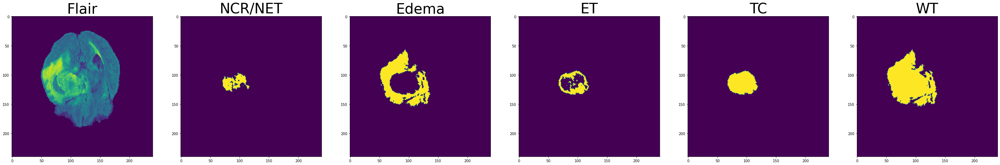
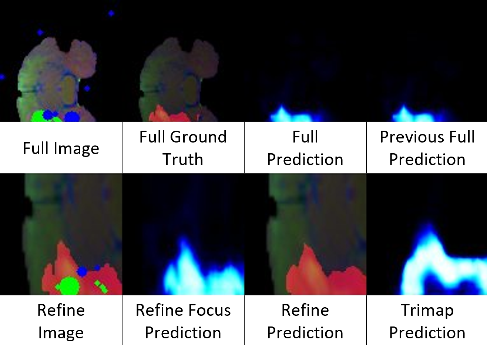
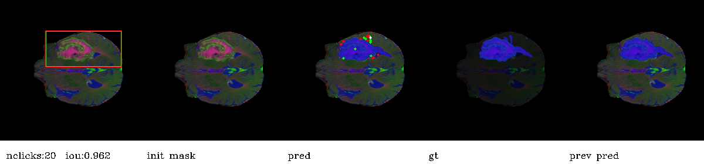
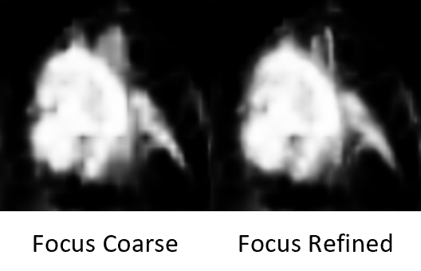

# Interactive Brain Tumor Segmentation (BraTS)
This repository contains the code and implementation details for accurately segmenting images of the human brain,
specifically targeting tumor diagnosis and treatment planning. The proposed method utilizes deep neural networks
with interactive segmentation techniques, aiming to improve accuracy
while minimizing user effort and computational requirements.




### Documents
- [Thesis - fa](./docs/iBraTS-Thesis-fa.pdf)
- [Slides - en](./docs/iBraTS-Slides-en.pptx)


### Table of Contents
1. [Abstract](#abstract)
2. [Key Features](#key-features)
3. [Installation](#installation)
4. [Simple Run](#simple-run)
5. [Experiments and Results](#experiments-and-results)
6. [License](#license)
7. [Acknowledgement](#license)


## Abstract
Accurately segmenting 3D images of the human brain is crucial for medical applications such as tumor diagnosis
and treatment planning. Deep neural networks have emerged as the most advanced automatic segmentation method,
but they may require modifications for clinical use. Interactive segmentation allows for greater accuracy
by incorporating user interactions, but current methods are not suitable for low-power systems and may require
significant user effort. This study utilizes a novel method that performs a coarse segmentation on a low-resolution
section of the target region, followed by a local refinement to restore lost resolution. To optimize efficiency,
morphological analysis is used to modify only areas that need updating while preserving previously obtained results
for other regions. Experimental results demonstrate that this method achieves more accurate results
with less user interaction and requires less computing power and time compared to other methods.
Additionally, this method shows acceptable generalization in tasks not encountered during the training phase.


## Key Features
- Deep learning-based approach for accurate brain image segmentation
- Interactive segmentation techniques to incorporate user interactions
- Coarse segmentation followed by local refinement to restore resolution
- Efficient computation using selective morphological analysis
- Reduced user effort and improved accuracy compared to existing methods
- Generalization capabilities beyond the training phase


## Installation
To set up the project, please follow these steps:

1. Clone this repository:
```bash
git clone https://github.com/ali-sedaghi/Interactive-BraTS.git
```

2. Install the required dependencies:
```bash
pip install -r requirements.txt
```

3. Download the dataset (BraTS2020) from
[source link](https://drive.google.com/drive/folders/1-_V-q80bmAGUhvyWT13rca4eEL-C7oXC?usp=share_link)
and place it in the following directory:
```bash
data/datasets/BraTS/
```

4. Download the pretrained models (SegFormer, HRNet, ResNet) from
[source link](https://drive.google.com/drive/folders/1iS9GHo627a81gbF7tTFBLHZQmqIMXUht?usp=share_link)
and place it in the following directory:
```bash
data/weights/
```

5. To train the model, run the following command with:
```bash
python ./scripts/train.py ./models/brats/segformerB3.py\
  --exp-name=Test\
  --epochs=2\
  --batch-size=2\
  --ngpus=0\
  --cpu\
  --workers=2\
  --datapath=./data/datasets/BraTS\
  --channel=mix\
  --label=wt\
  --pretrained
```

6. To evaluate the model, run the following command with:
```bash
python ./scripts/evaluate.py FocalClick\
  --model_dir=./experiments/brats/segformerB3/000_FocalClick-SegFormerB3/checkpoints/\
  --checkpoint=epoch-19-val-loss-1.28.pth\
  --infer-size=96\
  --datasets=BraTS_Val\
  --datapath=./data/datasets/BraTS\
  --channel=flair\
  --label=wt\
  --cpu\
  --target-iou=0.95\
  --n-clicks=20\
  --thresh=0.5\
  --print-ious\
  --vis
```

Refer to the source code and [Thesis](./docs/iBraTS-Thesis-fa.pdf) for additional options and configurations.


## Simple Run
You can use our ready to use notebooks on Kaggle and Google Colab.
- Kaggle train and evaluation notebook: [[Link]](https://www.kaggle.com/code/alisedaghi/runner)
- Google Colab train and evaluation notebook:
[[Link]](https://drive.google.com/file/d/1x_5paAO4z3stNoaQx8s9vKgx-FHrouk0/view?usp=sharing)
- Kaggle evaluation notebook: [[Link]](https://www.kaggle.com/code/zohrehbodaghi/evaluate)

Important hyperparameters:
```python
MODE = "FocalClick"  # CDNet, FocalClick
BACKBONE = "segformerB3"  # cdnet_res34, hrnet18s, hrnet32, segformerB3
CHANNEL = "mix"  # flair, t1, t1ce, t2, mix
LABEL = "wt"  # net, ed, et, wt, tc
EPOCHS = 20
BATCH_SIZE = 32
# Set --pretrained in below cell
```


## Experiments and Results
The experimental results demonstrate that our proposed method achieves more accurate segmentation results
with less user interaction and requires reduced computing power and time compared to other methods.
The model also exhibits acceptable generalization capabilities beyond the training phase.

For detailed results, analysis, and trained models please refer to our
[Experiments Drive](https://drive.google.com/drive/folders/17bD0_BudCUKC-7Z7y7hEhKjZ0rQ0ZGBE?usp=share_link) and
[Thesis](./docs/iBraTS-Thesis-fa.pdf).

### NoC and NoF metrics in Experiment 4
| Metric    | NoC80% | NoC85% | NoC90% | NoF85% | NoF90% | TPC   | Time    |
|-----------|--------|--------|--------|--------|--------|-------|---------|
| IoU       | 3.28   | 4.03   | 5.75   | 320    | 530    | 0.059 | 0:55:07 |
| Dice      | 2.45   | 2.81   | 3.48   | 176    | 246    | 0.059 | 0:55:07 |

### mIoU and mDice metrics in Experiment 4
| Metric    | Clicks=1 | Clicks=2 | Clicks=3 | Clicks=5 | Clicks=10 | Clicks=20 |
|-----------|----------|----------|----------|----------|-----------|-----------|
| mIoU      | 85.35 %  | 85.30 %  | 86.46 %  | 88.37 %  | 90.29 %   | 91.75 %   |
| mDice     | 88.96 %  | 88.84 %  | 89.75 %  | 91.16 %  | 92.78 %   | 94.12 %   |

### Output generated by the algorithm during a training phase step in Experiment 4


### Output generated by the algorithm during an evaluation phase step in Experiment 4


### Retrieving image details from test samples



## License
This project is licensed under the Apache License. See the [LICENSE](./LICENSE) file for details.


## Acknowledgement
The core framework of this codebase follows:

https://github.com/XavierCHEN34/ClickSEG
